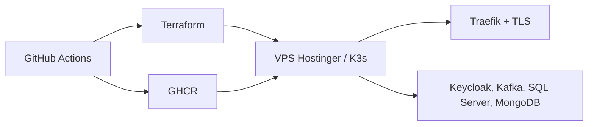

# fcs-infra

Infraestrutura compartilhada da **Conexão Solidária**. Centraliza a plataforma integrada na VPS Hostinger com K3s e os componentes comuns consumidos pelos serviços.

## Responsabilidades

- Provisionar a VPS, a fundação K3s e os namespaces da plataforma.
- Manter componentes compartilhados de rede, identidade, mensageria, persistência, segredos e observabilidade.
- Fornecer contratos de plataforma para que cada aplicação entregue seu próprio Deployment.
- Não conter regras de negócio nem dados de domínio dos serviços.

## Componentes

- Terraform para host, cluster e recursos de plataforma.
- Traefik e certificados TLS para exposição pública.
- Keycloak, SQL Server, Kafka, MongoDB, Infisical e Datadog no namespace `fcs-infra`.
- Namespaces e contratos de Secret das aplicações: `fcs-identity`, `fcs-campaign`, `fcs-donations`, `fcs-donation-worker`, `fcs-audit-logs`, `fcs-bff` e `fcs-web`.

## Estrutura do repositório

```text
terraform/vps/
  modules/host/        # Bootstrap e proteção do host
  modules/cluster/     # K3s, namespaces, Traefik e operadores
  modules/platform/    # Infisical, Datadog e manifestos compartilhados
  manifests/           # Serviços de plataforma
docker/                # Ambiente local de apoio
```

## Fluxo de entrega



## Referências oficiais

- [Visão geral](https://github.com/group10-tc-01/fcs-fase05-docs/blob/main/architecture/overview.md)
- [Repositórios e infraestrutura](https://github.com/group10-tc-01/fcs-fase05-docs/blob/main/architecture/repositories-and-infra.md)
- [ADR 0022 — Namespaces separados](https://github.com/group10-tc-01/fcs-fase05-docs/blob/main/adr/0022-use-separated-kubernetes-namespaces.md)
- [ADR 0024 — Plataforma VPS/K3s](https://github.com/group10-tc-01/fcs-fase05-docs/blob/main/adr/0024-use-vps-k3s-platform.md)

## Operação

As aplicações mantêm seus próprios manifests e pipelines. Valores sensíveis não são versionados: o Infisical sincroniza Secrets para o cluster. Use o guia `fcs-vps-infra-guide` para implantação e recuperação operacional.

## Pré-requisitos

- Terraform compatível com as versões declaradas em `terraform/vps/versions.tf`.
- Conta e token Hostinger, domínio configurado e acesso SSH temporário à VPS.
- Credenciais do GitHub Environment `production` e do Infisical.

## Validação local

```bash
terraform -chdir=terraform/vps fmt -check -recursive
terraform -chdir=terraform/vps init -backend=false
terraform -chdir=terraform/vps validate
```

O apply é executado somente pelo fluxo autorizado, com variáveis sensíveis fora do repositório.

## CI/CD

O workflow `.github/workflows/vps-terraform.yml` valida e aplica a infraestrutura mediante as proteções do environment `production`. Aplicações usam o `fcs-pipelines` para publicar imagens no GHCR e entregar seus manifests no K3s.

## Segurança e observabilidade

- Traefik e cert-manager protegem a borda pública com TLS.
- Infisical fornece os segredos sincronizados para os namespaces.
- Datadog e OpenTelemetry concentram logs, métricas e traces.
- SQL Server, MongoDB, Kafka e Keycloak permanecem internos ao cluster.

## Como esta infraestrutura atende ao hackathon

| Requisito do hackathon | Onde é atendido |
|---|---|
| Plataforma de microsserviços | VPS Hostinger, K3s e namespaces isolados |
| Segurança | Traefik, TLS, Infisical e serviços internos |
| Mensageria e persistência | Kafka, SQL Server e MongoDB compartilhados |
| Observabilidade | Datadog e OpenTelemetry Collector |
| Entrega contínua | Terraform, GHCR e pipelines reutilizáveis |
